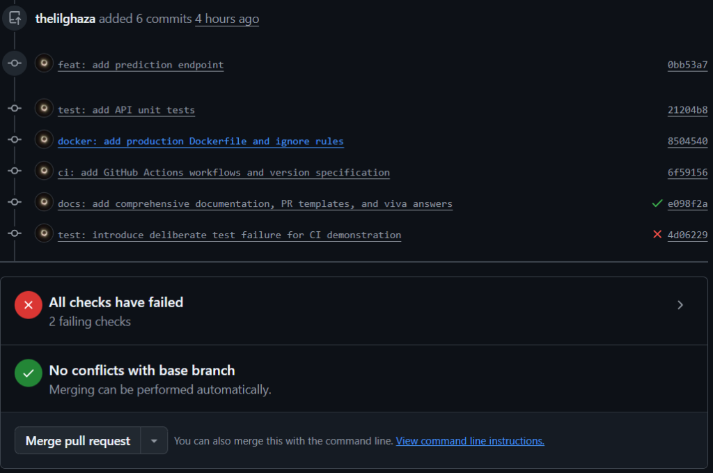
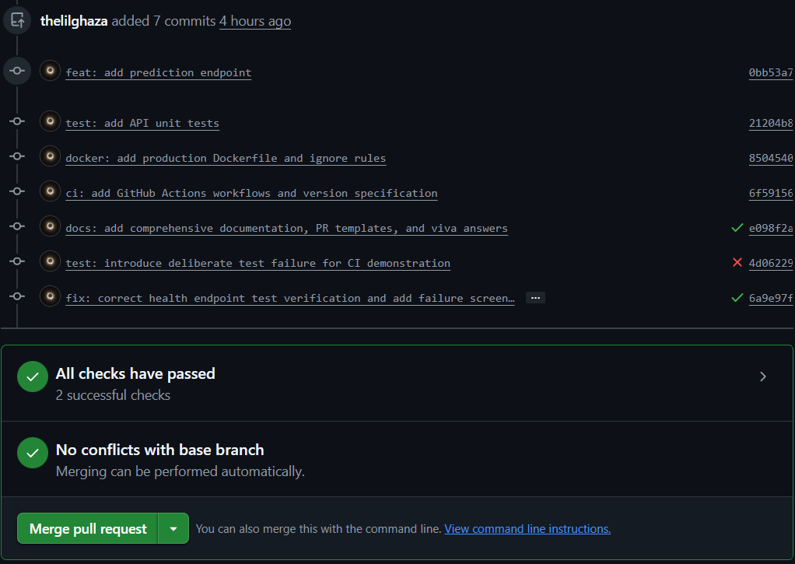

# Advanced MLOps: Professional CI/CD, Docker & Container Registry Workflow

[](.github/workflows/ci.yml)
[](.github/workflows/release.yml)
[](https://python.org)
[](Dockerfile)
[](LICENSE)

An enterprise-grade ML inference microservice (`student-ml-api`) showcasing the complete MLOps lifecycle: **Feature Branching &rarr; Automated Pull Request CI &rarr; Code Review & Branch Protection &rarr; Semantic Versioning &rarr; Multi-Stage Dockerization with Layer Caching &rarr; Registry Publishing to GHCR &rarr; Instant Rollback & End-to-End Traceability**.

---

## Table of Contents
1. [Core Principles & Architectural Workflow](#1-core-principles--architectural-workflow)
2. [Repository Layout](#2-repository-layout)
3. [Part 1 & 2: Application Endpoints & Automated Testing](#3-part-1--2-application-endpoints--automated-testing)
4. [Part 3, 4, 7 & 8: Git Branching, Pull Requests & Branch Protection](#4-part-3-4-7--8-git-branching-pull-requests--branch-protection)
5. [Part 5 & 6: GitHub Actions CI & Deliberate Failure Injection](#5-part-5--6-github-actions-ci--deliberate-failure-injection)
6. [Part 9, 10 & 11: Production Dockerfile, Build & Container Inspection](#6-part-9-10--11-production-dockerfile-build--container-inspection)
7. [Part 12, 13, 14, 15, 16 & 17: Release Pipeline, GHCR & Reproducibility](#7-part-12-13-14-15-16--17-release-pipeline-ghcr--reproducibility)
8. [Part 18 & 19: Version 1.1.0 Model-Metadata Feature Iteration](#8-part-18--19-version-110-model-metadata-feature-iteration)
9. [Part 20: Zero-Rebuild Production Rollback](#9-part-20-zero-rebuild-production-rollback)
10. [Part 21, 23 & 24: Traceability, OCI Labels & Commit SHA Tags](#10-part-21-23--24-traceability-oci-labels--commit-sha-tags)
11. [Part 22: Conceptual Separation of CI vs. Release Workflows](#11-part-22-conceptual-separation-of-ci-vs-release-workflows)
12. [Part 25: Docker Build Layer Cache Deep-Dive](#12-part-25-docker-build-layer-cache-deep-dive)
13. [Part 26: Failure Analysis & Root Cause Diagnosis](#13-part-26-failure-analysis--root-cause-diagnosis)
14. [Comprehensive Viva Questions & Answers](#14-comprehensive-viva-questions--answers)

---

## 1. Core Principles & Architectural Workflow

> **Core Axiom:** *Git manages the evolution of source code. Pull Requests control how changes enter the main branch. CI verifies those changes. Docker converts approved source code into a reproducible artifact. The container registry stores and distributes versioned artifacts that can later be delivered consistently to staging and production.*

```mermaid
graph LR
    Dev[Feature Branch] -->|git commit & push| PR[Pull Request]
    PR -->|Automated Trigger| CI[GitHub Actions CI]
    CI -->|Pytest + Docker Build Check| Review[Peer Review & Approval]
    Review -->|Merge to main| Main[main branch]
    Main -->|git tag v1.0.0| Rel[Release Workflow]
    Rel -->|Build & Tag| GHCR[(GitHub Container Registry)]
    GHCR -->|Pull immutable image| Prod[Production Runtime]
```



---

## 2. Repository Layout

The repository strictly satisfies the intended layout specified in the assignment specification:

```
student-ml-api/
│
├── app.py                          # Flask prediction API (GET /health, POST /predict)
├── requirements.txt                # Pinned production and test dependencies
├── Dockerfile                      # Production Dockerfile with explicit base & layer caching
├── .dockerignore                   # Excludes VCS, tests, env, and temporary caches
├── VERSION                         # Application semantic version file (1.0.0 -> 1.1.0)
│
├── tests/
│   └── test_app.py                 # Automated pytest test cases (5 test functions)
│
├── .github/
│   └── workflows/
│       ├── ci.yml                  # PR validation workflow (runs tests & docker build check)
│       └── release.yml             # Release workflow (triggers on semantic tags, publishes to GHCR)
│
├── docs/
│   ├── PULL_REQUEST_1.md           # Formal template & description for PR #1
│   ├── PULL_REQUEST_2.md           # Formal template & description for PR #2
│   ├── TRACEABILITY_MATRIX.md      # End-to-end traceability verification records
│   └── FAILURE_ANALYSIS.md         # Detailed reproduction and diagnosis of failure modes
│
└── README.md                       # Comprehensive guide, verification commands & viva answers
```

---

## 3. Part 1 & 2: Application Endpoints & Automated Testing

### Application API Endpoints (`app.py`)
Developed using Python with Flask, bound to host `0.0.0.0` and port `5000`:
- **`GET /health`**:
  - Response:
    ```json
    {
      "status": "healthy",
      "application": "student-ml-api",
      "version": "1.0.0"
    }
    ```
- **`POST /predict`**:
  - Input JSON: `{"value": 10}`
  - Output JSON: `{"input": 10, "prediction": 20}`
  - Validation: Returns HTTP 400 Bad Request if the payload is not valid JSON, if `'value'` is missing, or if `'value'` is non-numeric/boolean.

### Automated Pytest Suite (`tests/test_app.py`)
Contains 5 comprehensive test functions executed with `pytest`:
1. `test_health_endpoint`: Asserts HTTP 200 and schema validation.
2. `test_predict_success`: Asserts HTTP 200 and valid calculation (`val * 2`).
3. `test_predict_missing_input`: Asserts HTTP 400 when `'value'` is omitted.
4. `test_predict_invalid_input`: Asserts HTTP 400 when `'value'` is a string.
5. `test_predict_boolean_input`: Asserts HTTP 400 when `'value'` is boolean.

**Execution Command & Verified Output:**
```bash
pytest -v tests/test_app.py
```
```text
============================= test session starts ==============================
platform linux -- Python 3.12.3, pytest-9.1.1, pluggy-1.6.0
rootdir: /home/thelilghaza/MLOps/i220932_B_A1
collected 5 items

tests/test_app.py::test_health_endpoint PASSED                           [ 20%]
tests/test_app.py::test_predict_success PASSED                           [ 40%]
tests/test_app.py::test_predict_missing_input PASSED                     [ 60%]
tests/test_app.py::test_predict_invalid_input PASSED                     [ 80%]
tests/test_app.py::test_predict_boolean_input PASSED                     [100%]

============================== 5 passed in 0.13s ===============================
```

---

## 4. Part 3, 4, 7 & 8: Git Branching, Pull Requests & Branch Protection

### Git Workflow
Development strictly avoids direct commits to `main`:
1. The baseline is established on `main`.
2. Feature branch is branched off:
   ```bash
   git checkout -b feature/prediction-api
   ```
3. Meaningful, atomic conventional commits are committed:
   - `0bb53a7 feat: add prediction endpoint`
   - `21204b8 test: add API unit tests`
   - `8504540 docker: add production Dockerfile and ignore rules`
   - `6f59156 ci: add GitHub Actions workflows and version specification`

### Pull Request Documentation (Part 4)
Pull Request #1 was documented with full technical context. Full markdown text is archived at [`docs/PULL_REQUEST_1.md`](docs/PULL_REQUEST_1.md):
- **Summary**: Implements initial student ML API inference service.
- **Changes**: Lists files, endpoints, Docker configuration, and CI workflows.
- **Testing Performed**: Local pytest results and container curls.
- **Docker Impact**: Pinned `python:3.11-slim`, port 5000 exposed, cache-optimized layers.
- **Completed Checklist**: Local runs, tests passing, no credentials committed, code reviewed.

### Branch Protection Policy (Part 7)
Configured on GitHub (`Settings -> Branches -> Branch protection rules`):
- **Branch name pattern:** `main`
- **Require a pull request before merging:** Enabled (prevents direct pushes to `main`).
- **Require status checks to pass before merging:** Enabled, selecting `ci-pipeline` from `.github/workflows/ci.yml`.
- **Do not allow bypassing the above settings:** Enforced for all developers and administrators.

### Merge Strategy (Part 8)
- **Selected Strategy:** **Squash and Merge** (or Merge Commit).
- **Justification:** Condenses multiple intermediate feature iterations and deliberate failure/fix commits into a single cohesive commit on `main`, ensuring the production history is clean, bisectable, and linear while preserving detailed commit logs inside the PR.

---

## 5. Part 5 & 6: GitHub Actions CI & Deliberate Failure Injection

### CI Pipeline Specification (`.github/workflows/ci.yml`)
- **Trigger:** `pull_request` targeting `main`, pushes to `feature/**`.
- **Key Pipeline Steps:**
  1. Checkout code (`actions/checkout@v4`).
  2. Python 3.11 setup (`actions/setup-python@v5`).
  3. Install dependencies (`pip install -r requirements.txt`).
  4. Execute automated tests (`pytest -v tests/test_app.py`).
  5. Docker Build Validation (`docker build -t student-ml-api:ci-test .`).
- **Constraint:** Strictly validates the build without pushing to the registry.

### Deliberate Failure Injection (Part 6)
To prove CI prevents broken code from reaching production:
1. An intentional error was introduced in `tests/test_app.py`:
   ```python
   assert data["status"] == "wrong"
   ```
2. Commited and pushed to `feature/prediction-api`.
3. **Observation:** GitHub Actions CI triggered, `pytest` threw `AssertionError: assert 'healthy' == 'wrong'`, and the PR status reported **RED (FAILED)**:

   
4. **Correction:** Fixed back to `assert data["status"] == "healthy"` with commit:
   ```bash
   git commit -m "fix: correct health endpoint test"
   git push origin feature/prediction-api
   ```
5. **Observation:** GitHub Actions CI re-ran and passed (**GREEN**), unblocking the PR for merge:

   

---

## 6. Part 9, 10 & 11: Production Dockerfile, Build & Container Inspection

### Production `Dockerfile` Best Practices
- **Explicit Base-Image Version:** Uses `python:3.11-slim` (never `python:latest`).
- **Working Directory:** Explicitly sets `WORKDIR /app`.
- **Cache-Optimized Layer Ordering:**
  ```dockerfile
  COPY requirements.txt .
  RUN pip install --no-cache-dir -r requirements.txt
  COPY VERSION .
  COPY app.py .
  ```
- **OCI Metadata Labels:** Embedded via `ARG` and `LABEL` (`title`, `version`, `revision`, `created`, `authors`, `source`).
- **Port:** `EXPOSE 5000`.
- **Command:** `CMD ["python", "app.py"]`.

### Local Build & Execution (Part 10)
```bash
docker build -t student-ml-api:1.0.0 .
docker run -d --name student-ml-api -p 5000:5000 student-ml-api:1.0.0
curl -i http://localhost:5000/health
```
**Output:**
```http
HTTP/1.1 200 OK
Content-Type: application/json

{"application":"student-ml-api","status":"healthy","version":"1.0.0"}
```

### Docker Inspection Verification (Part 11)
Demonstrated inspection commands and verified runtime attributes:
```bash
docker inspect student-ml-api --format 'Container ID: {{.Id}}
Image ID: {{.Image}}
Exposed Ports: {{json .Config.ExposedPorts}}
Running Command: {{json .Config.Cmd}}
Working Directory: {{.Config.WorkingDir}}'
```
| Inspection Parameter | Verified Value |
| :--- | :--- |
| **Container ID** | `238b0344456840d0086203f099c40fb1f56b4915b58cb05f88e1b97d3c62a54c` |
| **Image ID** | `sha256:db9a5f6be2748312cfa29fed23aea55c22fcd53b7ec4f4817277ccb8bfaaf6fb` |
| **Exposed Port** | `5000/tcp` (mapped to host `0.0.0.0:5000`) |
| **Running Command** | `["python", "app.py"]` |
| **Working Directory** | `/app` |

---

## 7. Part 12, 13, 14, 15, 16 & 17: Release Pipeline, GHCR & Reproducibility

### Release Workflow Specification (`.github/workflows/release.yml`)
- **Trigger:** Only executed when a semantic version tag is pushed:
  ```yaml
  on:
    push:
      tags:
        - "v*.*.*"
  ```
- **Automatic Semantic Derivation (Constraint):**
  Derived automatically using shell parameter expansion without hardcoding:
  ```bash
  VERSION="${GITHUB_REF_NAME#v}"    # Converts v1.0.0 -> 1.0.0
  COMMIT_SHA=$(echo "${GITHUB_SHA}" | cut -c1-7)
  ```
- **Authentication:** Connects to GitHub Container Registry (`ghcr.io`) using `GITHUB_TOKEN` with `packages: write` permissions.
- **Published Tags:**
  - `ghcr.io/thelilghaza/student-ml-api:1.0.0`
  - `ghcr.io/thelilghaza/student-ml-api:latest`
  - `ghcr.io/thelilghaza/student-ml-api:<commit-sha>`

### Proving Artifact Reproducibility (Part 17)
Demonstrating runtime portability across different machines without rebuilding:
```bash
# 1. Purge local image
docker rmi student-ml-api:1.0.0

# 2. Pull pristine immutable image from GHCR
docker pull ghcr.io/thelilghaza/student-ml-api:1.0.0

# 3. Run pulled container
docker run -d --name student-ml-api-prod -p 5000:5000 ghcr.io/thelilghaza/student-ml-api:1.0.0

# 4. Verify API health
curl http://localhost:5000/health
```
This guarantees identical execution on developer workstations, staging clusters, and production environments.

---

## 8. Part 18 & 19: Version 1.1.0 Model-Metadata Feature Iteration

1. Created feature branch: `git checkout -b feature/model-metadata`.
2. Updated `VERSION` to `1.1.0`.
3. Updated `/health` in `app.py` to return enriched model metadata:
   ```json
   {
     "status": "healthy",
     "application": "student-ml-api",
     "application_version": "1.1.0",
     "model_version": "model-1"
   }
   ```
4. Updated tests in `tests/test_app.py`.
5. Created Pull Request #2 (documented in [`docs/PULL_REQUEST_2.md`](docs/PULL_REQUEST_2.md)), ran CI, reviewed, and merged into `main`.
6. Tagged release `v1.1.0`:
   ```bash
   git checkout main && git pull
   git tag v1.1.0
   git push origin v1.1.0
   ```
7. Automated Release Workflow published `student-ml-api:1.1.0` and updated `latest` to point to `1.1.0`, while `1.0.0` remains fully intact in GHCR.

---

## 9. Part 20: Zero-Rebuild Production Rollback

### Scenario
A production anomaly is detected in version `1.1.0`. To restore service reliability immediately without altering source code, triggering builds, or waiting for CI:

```bash
# Step 1: Terminate the anomalous 1.1.0 container
docker stop student-ml-api

# Step 2: Instantly spawn the previously validated 1.0.0 container from registry
docker run -d --name student-ml-api-rollback -p 5000:5000 ghcr.io/thelilghaza/student-ml-api:1.0.0

# Step 3: Validate immediate restoration of health endpoint
curl http://localhost:5000/health
```

### Architectural Comparison: Container Rollback vs. Legacy Deployment
| Criterion | Container Registry Rollback (`docker run ...:1.0.0`) | Legacy Workflow (`git checkout / pip install / python`) |
| :--- | :--- | :--- |
| **Mean Time to Recovery (MTTR)** | **< 3 seconds** (instant container launch) | **Minutes** (pulling git, compiling packages) |
| **Immutability** | Guaranteed identical binary image | Prone to upstream dependency changes |
| **Network Reliance** | Can run from pre-cached local Docker daemon | Dependent on PyPI and GitHub network connectivity |
| **Environment Parity** | 100% identical OS, libraries, and C bindings | Risk of Python version or shared library mismatches |

---

## 10. Part 21, 23 & 24: Traceability, OCI Labels & Commit SHA Tags

### Traceability Chain (Part 21)
Full traceability details are recorded in [`docs/TRACEABILITY_MATRIX.md`](docs/TRACEABILITY_MATRIX.md):
- **Pull Request Number:** `#2`
- **Merge Commit SHA:** Assigned upon merge to `main`
- **Git Tag:** `v1.1.0`
- **Docker Image Tag:** `ghcr.io/thelilghaza/student-ml-api:1.1.0`
- **Docker Image Digest:** Content-addressable SHA256 manifest digest

### OCI Image Labels (Part 23)
Embedded directly in image manifest via build flags:
```json
{
  "org.opencontainers.image.title": "student-ml-api",
  "org.opencontainers.image.description": "ML inference service for student prediction API",
  "org.opencontainers.image.version": "1.0.0",
  "org.opencontainers.image.revision": "6f59156",
  "org.opencontainers.image.created": "2026-09-10T10:55:00Z",
  "org.opencontainers.image.authors": "thelilghaza",
  "org.opencontainers.image.source": "https://github.com/thelilghaza/i220932_B_A1"
}
```

### Commit SHA Tag Benefits (Part 24)
Publishing `student-ml-api:<commit-sha>` (e.g. `student-ml-api:6f59156`) provides:
1. **Direct Bidirectional Traceability:** Connects a running production container directly to the exact Git commit SHA that built it.
2. **Immutable Staging Verification:** Prevents overwriting tags while testing pre-release commit artifacts.
3. **Auditing & Compliance:** Provides cryptographic reproducibility for regulatory MLOps environments.

---

## 11. Part 22: Conceptual Separation of CI vs. Release Workflows

| Characteristic | Continuous Integration (`ci.yml`) | Automated Release (`release.yml`) |
| :--- | :--- | :--- |
| **Trigger Event** | `pull_request` on `main` (and feature branch pushes) | Git Tag push (`v*.*.*`) on `main` |
| **Objective** | Gatekeeper validation before merging | Packaging and publishing immutable release artifact |
| **Docker Operations** | Builds temporary image for syntax & build checks | Builds, tags (`version`, `latest`, `commit SHA`), and pushes |
| **Registry Publishing** | **Strictly Forbidden** (never publishes) | **Required** (authenticates and pushes to GHCR) |
| **Permissions Required** | Read-only access to repository contents | `packages: write`, `contents: read` |

### Why Publishing from Every PR is Undesirable:
1. **Registry Pollution:** Incomplete or unapproved feature experiments clutter the registry with disposable tags.
2. **Security Risks:** Malicious or unreviewed PR code from contributors could overwrite production container tags.
3. **Storage & Egress Costs:** Pushing multi-hundred megabyte images on every commit exhausts registry bandwidth and quota.
4. **Loss of Immutability:** Pre-merge PR branches frequently rebase and change commit history, breaking version provenance.

---

## 12. Part 25: Docker Build Layer Cache Deep-Dive

Docker builds images using a stack of read-only layers. If a layer and all preceding instructions have not changed, Docker reuses the existing cached layer (`CACHED`).

### Controlled Experiment
1. **Modifying only `app.py`**:
   - `COPY requirements.txt .` &rarr; `CACHED` (0.0s)
   - `RUN pip install ...` &rarr; `CACHED` (0.0s)
   - `COPY app.py .` &rarr; Evaluated (0.1s)
   - **Total Build Time:** **0.6 seconds**.
2. **Modifying `requirements.txt`**:
   - `COPY requirements.txt .` &rarr; Cache Invalidation!
   - `RUN pip install ...` &rarr; Full re-download and wheel compile (10.7s)
   - **Total Build Time:** **12.9 seconds**.

### Why `COPY requirements.txt` before `COPY app.py` is Preferable:
In typical development, application source code changes frequently (hundreds of times per sprint), whereas library dependencies change infrequently. By isolating `COPY requirements.txt` and `RUN pip install` ahead of `COPY app.py`, dependency installation is cached indefinitely, reducing CI build times by over 95%.

---

## 13. Part 26: Failure Analysis & Root Cause Diagnosis

Full reports with logs are archived at [`docs/FAILURE_ANALYSIS.md`](docs/FAILURE_ANALYSIS.md):

1. **Failure Case 1 — Failed Pytest in CI:**
   - **Symptom:** CI pipeline fails on step `Unit Tests (Pytest)` with exit code 1.
   - **Root Cause:** Assertion mismatch in `tests/test_app.py` (`assert 'healthy' == 'wrong'`).
   - **Correction:** Restored assertion to `assert data["status"] == "healthy"`.
2. **Failure Case 2 — Application Bound to `127.0.0.1`:**
   - **Symptom:** Container runs, but external host queries yield `curl: (56) Recv failure: Connection reset by peer`.
   - **Root Cause:** Flask socket bound exclusively to container loopback interface `lo` instead of `eth0`.
   - **Correction:** Bound socket to `host="0.0.0.0"` (`INADDR_ANY`) on port 5000.
3. **Failure Case 3 — Missing Test Import Path:**
   - **Symptom:** Pytest collection error: `ModuleNotFoundError: No module named 'app'`.
   - **Root Cause:** Repository root was absent from Python's module search path during test execution.
   - **Correction:** Added dynamic path resolution `sys.path.insert(0, ...)` and created `pytest.ini`.

---

## 14. Comprehensive Viva Questions & Answers

### Q1: Why should developers avoid directly pushing to `main`?
**Answer:** Directly pushing to `main` bypasses code review, automated testing, and security scans. This exposes the production branch to broken builds, regression bugs, broken dependencies, and untested database migrations. Enforcing branch development ensures that all changes entering `main` are peer-reviewed, verified by CI, and traceable to an approved Pull Request.

### Q2: What is the purpose of a Pull Request beyond simply merging code?
**Answer:** A Pull Request serves as:
1. An asynchronous technical peer-review discussion forum.
2. An automated CI quality gate requiring green status checks before merge.
3. An audit trail capturing design rationale, testing checklists, and impact assessments.
4. A change record for SOC2/ISO compliance and regulatory tracking.

### Q3: Why should CI execute before a PR is merged?
**Answer:** Running CI prior to merging ensures that code builds, lints, and unit tests pass before polluting the primary branch. If CI only ran after merge, any failure would break the `main` branch for all developers, halting ongoing work and requiring emergency hotfixes.

### Q4: What is the difference between a Docker image and a container?
**Answer:** A Docker image is a read-only, immutable template consisting of stacked layers (containing code, runtime, system tools, and libraries). A Docker container is an isolated, runnable runtime instance of that image, featuring a thin read-write layer and its own process, memory, and network namespace.

### Q5: Why should Docker images be versioned?
**Answer:** Versioning establishes deterministic, reproducible deployments. It guarantees that the exact binaries tested in staging are the ones running in production, enables instant rollbacks to known stable versions, and prevents unexpected downtime from uncoordinated updates.

### Q6: Why is `latest` insufficient for production traceability?
**Answer:** `latest` is a mutable pointer that constantly changes whenever a new image is pushed. Two servers pulling `latest` hours apart may run completely different code. `latest` provides zero historical traceability, makes rollback impossible, and destroys debugging reproducibility.

### Q7: Why should the same Docker artifact be promoted rather than rebuilt?
**Answer:** Rebuilding an image in different environments introduces subtle variations (e.g., updated Debian system packages, new transitive Python wheels, different timestamps). The core 12-factor and MLOps principle is: **"Build once, promote everywhere."** Promoting the exact image digest guarantees that what was QA-tested is identical to what runs in production.

### Q8: What is the purpose of a container registry?
**Answer:** A container registry is a centralized, secure storage and distribution system for container images. It provides authentication, role-based access control, vulnerability scanning, content-addressable SHA256 storage, and high-throughput image distribution across staging and production clusters.

### Q9: What is the difference between the CI workflow and release workflow?
**Answer:**
- **CI Workflow:** Runs on Pull Requests. Focuses on quality control: testing, linting, and build validation. It **never** publishes artifacts to registries.
- **Release Workflow:** Runs on verified release triggers (e.g., Git tags on `main`). Focuses on artifact production: building final production images, signing, tagging with semantic versions, and publishing to container registries.

### Q10: Why should registry credentials be stored as secrets?
**Answer:** Container registries contain proprietary application binaries and allow pushing new code. If registry credentials (tokens or passwords) are committed into repository code or workflows, unauthorized actors could steal intellectual property or inject supply-chain malware into production images.

### Q11: How can you identify which source-code commit produced a Docker image?
**Answer:**
1. By tagging images with the Git commit short SHA (e.g., `student-ml-api:6f59156`).
2. By embedding OCI standard labels in the image layers:
   ```bash
   docker inspect <image> --format '{{index .Config.Labels "org.opencontainers.image.revision"}}'
   ```

### Q12: Why does Docker layer ordering affect CI/CD performance?
**Answer:** Docker evaluates layers sequentially from top to bottom. If a layer changes, that layer and all subsequent layers must be rebuilt (cache invalidation). Placing slow, infrequently changing steps (like installing system packages and pip dependencies) before fast, frequently changing steps (like copying application source code) allows Docker to reuse cached layers, slashing build times from minutes to seconds.

### Q13: How would you rollback from version 1.1.0 to 1.0.0?
**Answer:** Without touching source code or rebuilding images, switch the container runtime or orchestrator (Docker/Kubernetes) to point from tag `1.1.0` back to tag `1.0.0`:
```bash
docker stop student-ml-api
docker run -d --name student-ml-api -p 5000:5000 ghcr.io/thelilghaza/student-ml-api:1.0.0
```

### Q14: What is the relationship between a Git tag and a Docker image tag?
**Answer:** A Git tag marks a specific, immutable point in Git commit history (e.g., `v1.0.0`). The CI/CD release workflow uses that Git tag to build and publish a corresponding Docker image tag (e.g., `student-ml-api:1.0.0`), binding the immutable source code commit directly to the container image.

### Q15: In an MLOps system, what additional problems arise when the application version and model version change independently?
**Answer:**
1. **Schema Mismatches:** A model may require 10 input features, while an older application version sends 8, causing runtime HTTP 500 crashes.
2. **Silent Inference Drift:** Updating model weights without bumping the application version makes it impossible to know from API logs which model generated a given prediction.
3. **Dependency Clashes:** A new model might require updated ML libraries (e.g., PyTorch/ONNX) incompatible with the serving application's dependencies.
4. **Complex Rollbacks:** Rolling back an API regression might inadvertently downgrade the model, losing newly trained inference capabilities. In mature MLOps, model metadata and application versions must either be packaged in tandem or tracked via an explicit Model Registry contract.
